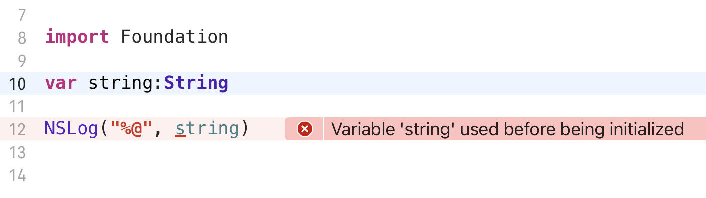

# 可选类型（Optional）

> 可选值类型（Optional类型）是Swift语言特有的一种类型

### 为什么 Swift 会有可选类型

Swift语言是一种**强调类型安全**的语言，开发者在使用到某个变量时，编译器会尽最大可能保证此变量的类型和值的明确性， 保证减少编程中的不可控因素

在实际的开发中，任何类型的变量都会遇到**值为空**的情况

- **Objective-C** 没有机制来专门监控和管理为空值的变量，程序的运行安全性全部靠开发者手动控制

- **Swift** 提供了一种**包装的方式**来对普通类型进行**Optional包装**，**实现对空值情况的监控**

### "先声明后赋值" 的应用场景

> 一个变量**在声明的时候没有赋初值**，在后面的**程序运行中有可能被赋值**

**Objective-C** 不是强调类型安全的语言(基于C语言)，所以对于没有赋值的变量，没有访问的限制

对于这种情况，通常在使用之前判断一下是否为空

在Swift语言中，如果使用了一个没有赋值的变量，程序会直接报错并停止运行

