# 可选类型（Optional）

> 可选值类型（**Optional类型**）是Swift语言特有的一种类型

## 为什么 Swift 会有可选类型

Swift 语言是一种**强调类型安全**的语言，开发者在使用到某个变量时，编译器会尽最大可能保证此变量的类型和值的明确性， 保证减少编程中的不可控因素

在实际的开发中，任何类型的变量都会遇到**值为空**的情况

- **Objective-C** 没有机制来专门监控和管理为空值的变量，程序的运行安全性全部靠开发者手动控制

- **Swift** 提供了一种**包装的方式**来对普通类型进行**Optional包装**，**实现对空值情况的监控**

## "先声明后赋值" 的应用场景

> 一个变量**在声明的时候没有赋初值**，在后面的**程序运行中有可能被赋值**

**Objective-C** 不是强调类型安全的语言(基于C语言)，所以对于没有赋值的变量，没有访问的限制

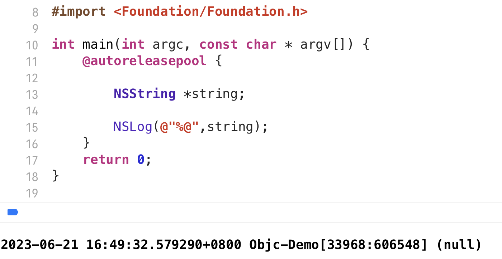

对于这种情况，通常在使用之前判断一下是否为空

在Swift语言中，如果使用了一个没有赋值的变量，程序会直接报错并停止运行

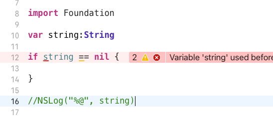

- 在Swift语言中，**未做初始化的普通类型是不允许使用的**，哪怕是用来进行判空处理也不被允许

- 如果一个变量在**逻辑上可能为nil**，则开发者需要将 其包装为 **Optional 类型**，改写上面的代码如下

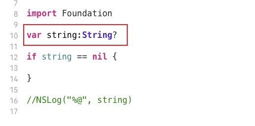

## 可选类型的使用

在声明 string 变量的时候，这里将其声明成了 **String? 类型**，**在普通类型后面添加符号 ' ? '**，即可将普通类型包装为 Optional 类型。

实例对象后面也可以加 '?' 这代表可选链调用

Optional 类型 不会独立存在，其总是附着于某个具体的数据类型之上，具体的数据类型可以是**基本数据类型**，可以是**结构体**，也可以是**类**，等等

### **Optional 类型只有两种值**

- 如果没有对这个可选类型变量赋值，则为nil
- 如果进行了赋值，那这个可选类型变量可以通过拆包的方式获取具体值

## 强制拆包

上面提到了拆包，**Optional 类型是对普通类型的一种包装**，因此**在使用的时候需要对其进行强制拆包操作**，**拆包将使 用到Swift中的操作符 ' ! '**

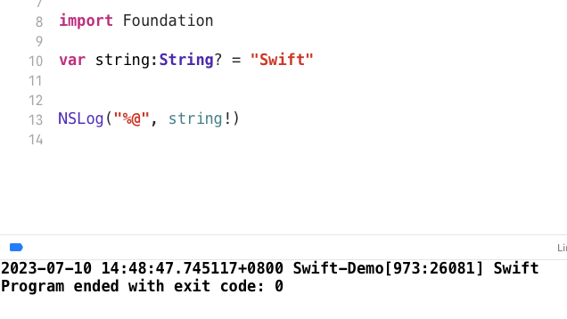

### 强制拆包的注意点

- 在使用 “!” 进行Optional值的强制拆包操作时，必须保证要拆包的值不为nil，否则程序运行会出错

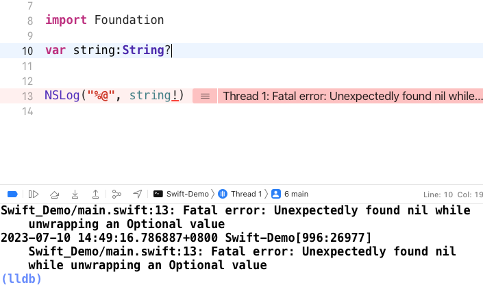

- 可以在拆包前使用 if语句 进行安全判断
- 这种方式是安全的，因为它会在拆包前检查可选项是否包含一个非空值，也称之**为可选项拆包**

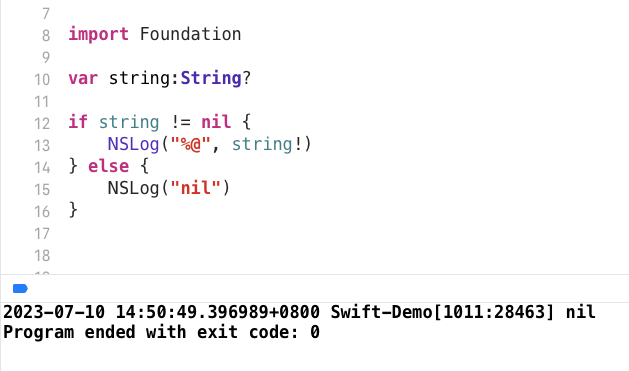

### 可选项拆包 (Optional Unwrapping)

Swift语言还提供了一种 **if-let 或 guard let 语法** 结构来进行可选项拆包

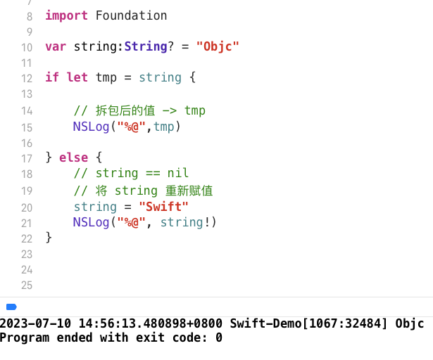

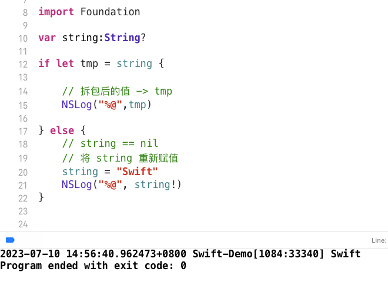

在 else 里，也可以直接打印一个 "变量为空"

if-let结构中也可以同时进行多个Optional类型值的绑定，之间用逗号隔开

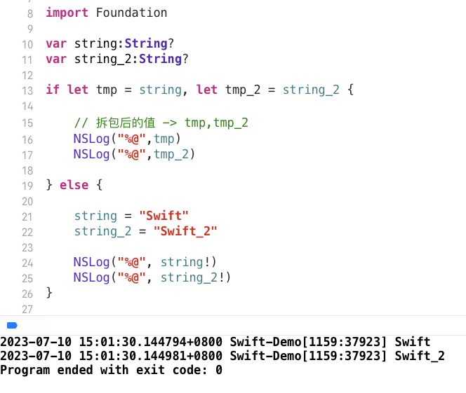

- **只有所有Optional值都不为nil，才会进入 if 为真的语句**

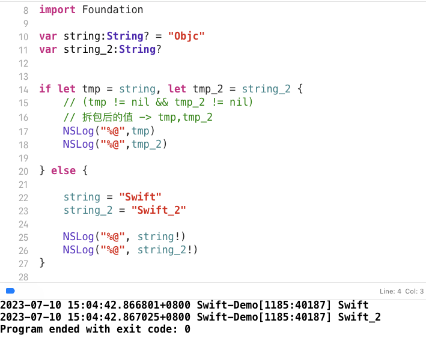

## 隐式解析

对于一个可选值类型的变量，每次使用时我们都需要为其进行拆包操作，这相对会有些麻烦

Swift 中有一种语法:**隐式解析**

- 当明确某个变量初始时为nil
- 并且在之后使用之前一定会被赋值时

可以将其声明为**隐式解析的可选值**

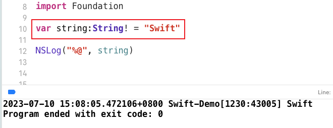

## 总结

- **' ? ' 和 ' ! '** 是 Swift 工程中常见的两个符号，可分为两种情况讨论
- 类型
  - <类型>？ 表示 **可选类型**
  - <类型>！ 表示 **默认为隐式解析的可选类型**
- 实例对象
  - <对象>? 表示 **可选链调用**
  - <对象>! 表示 **强制拆包**

