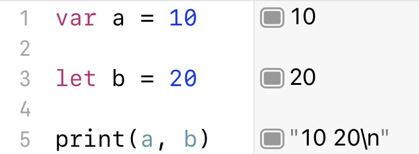
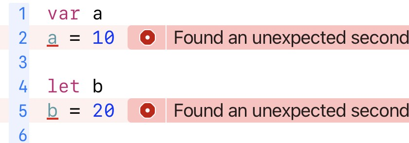
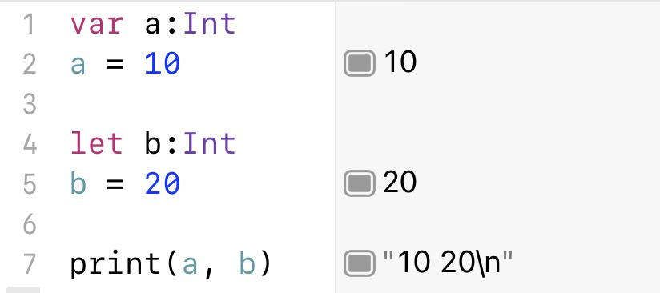

### 声明变量

如果声明变量的时候赋值，可以省略数据类型，**编译器可以推断数据类型**

如果只是声明变量，不赋值，那么就需要声明的时候写数据类型 (无论是常量还是变量)

**常量只能赋值一次**，这个和很多编程语言一样

不过常量的值不要求编译的时候确定，只要使用前赋值一次就可以

另外，常量和变量在初始化前，是不能使用的

### 数据类型

Swift 数据类型分两种

- 值类型 (value type)
  - 枚举 (enum) 
  - 结构体 (struct)
- 引用类型 (reference type)
  - 类 (class)

省略参数标签需要注意

- 一旦写了省略参数标签，那么在使用这个函数的时候就一定不能写参数标签

### 可变参数

**紧跟**在可变参数后面的参数**不能省略参数标签**

主要是为了解决歧义问题

因为如果紧跟的类型和可变参数类型一致，就会产生歧义