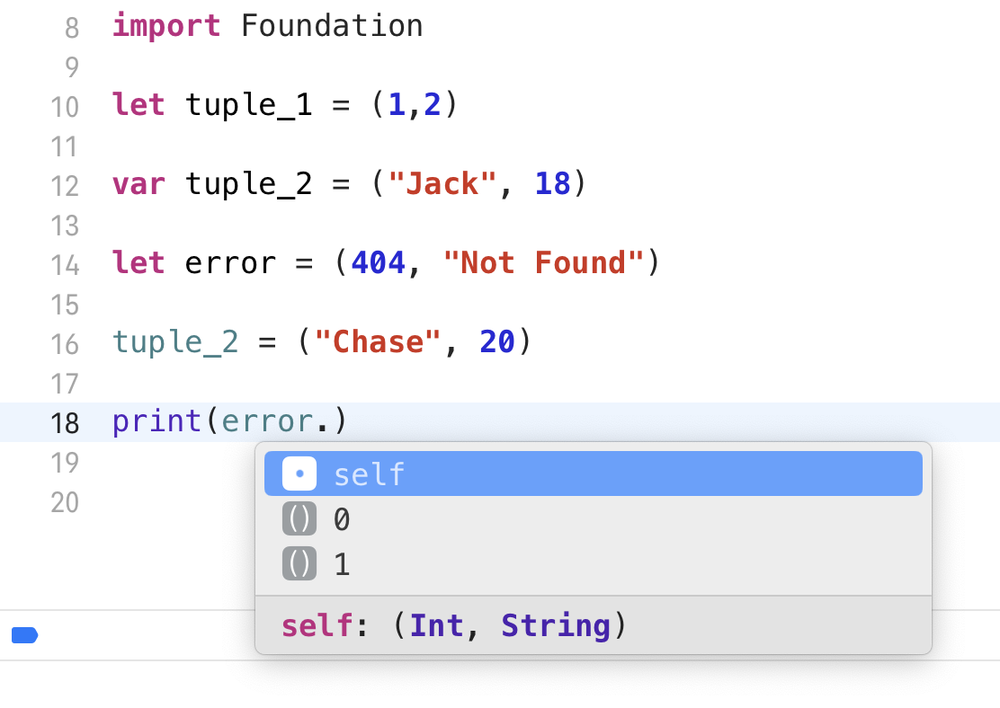

# 数据类型

## 1. 元组 (tuple)

> 将多种数据类型组合在一起
>
> 当然，数据类型可以相同，可以不同

### 使用元组的场景

- **函数有多个返回值**
  - 可以避免创建一个自定义的数据结构来包含返回值，而**直接使用元组来返回多个值**

- **临时存储 / 传递 / 使用数据**

### 需要注意的地方

- 元组在使用场景上很像结构体，但是**元组的本质不是结构体**，元组是元组，结构体是结构体，两者是不同的数据类型

### 定义元组

##### 默认的方式

##### 为元素添加名称

### 访问元组元素

##### 默认的方式

通过序号来访问

##### 通过名称来访问

没有定义名称的通过序号访问

##### 将元组转换为单个变量

### 

