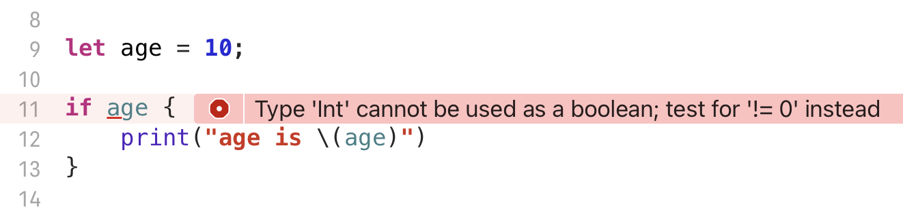

# if-else

- if 的条件可以省略小括号

- if 后面的条件只能是 Bool / Boolean 类型

# for-in

**Swift 不支持像 C 或 Java 中的传统三段式 for 循环** 

即  `for (initialization; condition; increment/decrement)` 的写法

在 Swift 中，for 循环的初始化、循环条件和循环迭代都是通过 **for-in** 来实现的

# while

- while 的条件可以省略小括号
- 用法与其他语言一致
  - 从Swift3开始，移除了自增(++)，自减(--) 运算符
- repeat-while 相当于 do-while
